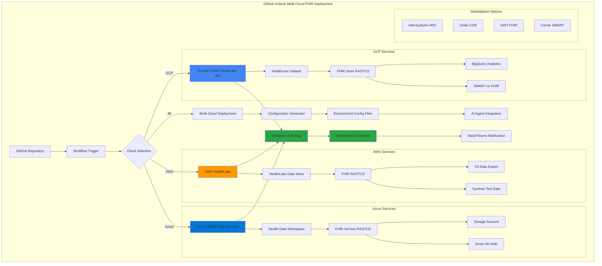

# 🏥 Multi-Cloud FHIR Server Deployment Guide

## 🚀 Enhanced GitHub Actions Workflow

Your repository now includes a **comprehensive multi-cloud FHIR server deployment workflow** that deploys FHIR servers from the official catalogs of all three major cloud providers.

## 🌟 What's Deployed

### Native Cloud FHIR Services
- **🔵 Google Cloud**: Healthcare API with FHIR stores (R4, STU3, DSTU2, R5)
- **🟠 AWS**: HealthLake with Synthea test data and S3 integration
- **🟣 Azure**: Health Data Services with Azure AD authentication

### 🛒 Available Marketplace Alternatives
- **InterSystems IRIS for Health** (all clouds)
- **Smile CDR** (AWS, GCP, Azure)
- **HAPI FHIR** (open source, all clouds)
- **Cerner SMART on FHIR** (marketplace)

## 🎯 Deployment Options

### 1. Standard Deployment
```yaml
deployment_options: standard
```
- Full FHIR server with analytics
- BigQuery streaming (GCP)
- S3 export capability (AWS)
- CORS and SMART on FHIR enabled

### 2. With Analytics
```yaml
deployment_options: with_analytics
```
- Enhanced analytics configuration
- Advanced BigQuery schema (GCP)
- Optimized for data science workflows

### 3. With Synthea Data
```yaml
deployment_options: with_synthea_data
```
- Pre-loads realistic synthetic patient data
- Great for testing and development
- Available on AWS HealthLake

### 4. Minimal
```yaml
deployment_options: minimal
```
- Basic FHIR server without extras
- Cost-optimized for development
- No analytics or test data

## ⚡ Quick Start

### Run the Deployment
1. Go to **Actions** tab in your GitHub repository
2. Select **Deploy FHIR Servers Multi-Cloud**
3. Click **Run workflow**
4. Configure your deployment:
   - **Cloud providers**: `all`, `gcp`, `aws`, `azure`, or combinations
   - **Environment**: `staging` or `production`
   - **FHIR version**: `R4`, `STU3`, `DSTU2`, or `R5`
   - **Options**: Choose deployment type
   - **Webhook**: (Optional) Slack/Teams notification URL

### Example Configurations

#### Deploy to All Clouds (Production)
```yaml
cloud_providers: all
environment: production
fhir_version: R4
deployment_options: standard
```

#### Deploy to AWS + GCP (Staging with Test Data)
```yaml
cloud_providers: gcp,aws
environment: staging
fhir_version: R4
deployment_options: with_synthea_data
```

#### Minimal Development Setup
```yaml
cloud_providers: gcp
environment: staging
fhir_version: R4
deployment_options: minimal
```

## 🔐 Required Secrets

### Common Secrets
```bash
OPENAI_API_KEY          # For AI agents
FHIR_CLIENT_ID         # FHIR client credentials
FHIR_CLIENT_SECRET     # FHIR client secret
```

### Cloud-Specific Secrets
```bash
# Google Cloud Platform
GCP_PROJECT_ID         # Your GCP project ID
GCP_SA_KEY            # Service account JSON key

# Amazon Web Services  
AWS_ACCESS_KEY_ID     # AWS access key
AWS_SECRET_ACCESS_KEY # AWS secret key

# Microsoft Azure
AZURE_CREDENTIALS     # Service principal JSON
```

## 📊 What Gets Created

### Google Cloud Platform
- Healthcare Dataset: `healthcare-ai-dataset-{environment}`
- FHIR Store: `fhir-store-{environment}`
- BigQuery Dataset: `healthcare_analytics_{environment}`
- SMART on FHIR enabled
- Analytics streaming configured

### Amazon Web Services
- HealthLake Data Store: `healthcare-ai-datastore-{environment}`
- S3 Export Bucket: `healthcare-ai-exports-{environment}-{timestamp}`
- IAM Role: `HealthLakeExportRole-{environment}`
- KMS encryption (production)
- Optional Synthea data preload

### Microsoft Azure
- Resource Group: `healthcare-ai-fhir-rg-{environment}`
- Workspace: `healthcare-ai-workspace-{environment}`
- FHIR Service: `healthcare-ai-fhir-{environment}`
- Storage Account: `healthcaredata{environment}{timestamp}`
- Azure AD authentication

## 🧪 Testing & Validation

### Automatic Tests
- ✅ FHIR server connectivity
- ✅ Capability statement validation
- ✅ Authentication verification
- ✅ Export functionality (if enabled)

### Manual Testing
```bash
# GCP FHIR Store
curl -H "Authorization: Bearer $(gcloud auth print-access-token)" \
     "https://healthcare.googleapis.com/v1/projects/{project}/locations/us-central1/datasets/{dataset}/fhirStores/{store}/fhir/metadata"

# AWS HealthLake (requires proper IAM)
aws healthlake describe-fhir-datastore --datastore-id {datastore-id}

# Azure FHIR Service
curl -H "Authorization: Bearer {azure-token}" \
     "https://{workspace}-{service}.fhir.azurehealthcareapis.com/metadata"
```

## 📈 Monitoring & Analytics

### Built-in Analytics
- **GCP**: BigQuery streaming for real-time analytics
- **AWS**: S3 exports for data lake integration
- **Azure**: Storage account for data export

### Configuration Files
The workflow automatically generates environment-specific configuration files:
```yaml
config/fhir/fhir-endpoints-{environment}.yaml
```

## 🔄 Integration with AI Agents

Your existing AI agents (`autogen_fhir_agent` and `crewai_fhir_agent`) can automatically discover and use the deployed FHIR servers through the generated configuration files.

## 🚨 Troubleshooting

### Common Issues
1. **Authentication failures**: Check cloud credentials in secrets
2. **Resource already exists**: The workflow handles existing resources gracefully
3. **Deployment timeouts**: Synthea data preload can take 30-60 minutes
4. **CORS issues**: Standard deployment includes CORS configuration

### Getting Help
- Check GitHub Actions logs for detailed error messages
- Review cloud provider quotas and limits
- Ensure all required APIs are enabled
- Verify IAM permissions are sufficient

## 🎉 Success!

Once deployed, you'll have:
- ✅ Production-ready FHIR servers across multiple clouds
- ✅ Analytics and export capabilities
- ✅ Proper authentication and security
- ✅ Integration with your AI agents
- ✅ Automated configuration management

Your FHIR infrastructure is now ready to support healthcare AI applications at scale! 🏥✨ 

### 🏗️ Multi-cloud FHIR Deployment Architecture



This diagram shows the complete workflow from GitHub repository trigger through multi-cloud deployment to final AI agent integration.