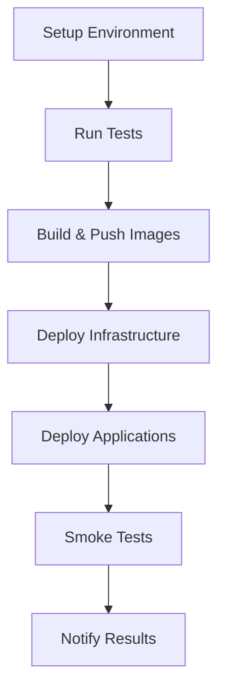
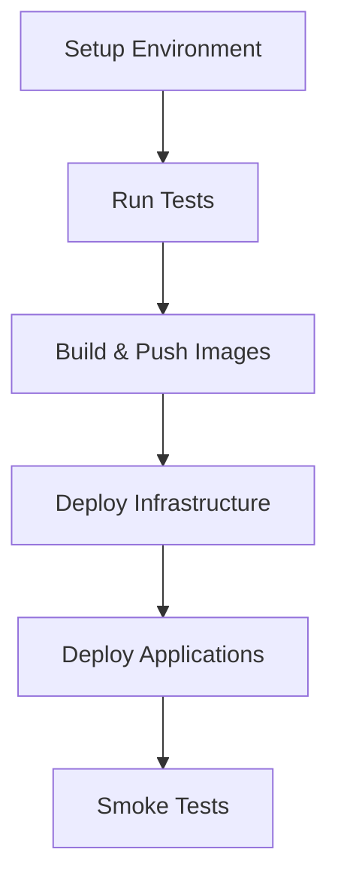

# GitHub Actions CI/CD Workflows

This directory contains GitHub Actions workflows for automated building, testing, and deployment of the Healthcare AI Agents to three major cloud platforms.

## 🚀 Available Workflows

### 1. [deploy-gcp.yml](./deploy-gcp.yml) - Google Cloud Platform
- **Triggers**: Push to `main`/`develop`, Pull Requests, Manual dispatch
- **Services**: GKE, Cloud SQL (PostgreSQL), GCR
- **Features**: Auto-scaling, Load balancing, Health checks

### 2. [deploy-aws.yml](./deploy-aws.yml) - Amazon Web Services  
- **Triggers**: Push to `main`/`develop`, Pull Requests, Manual dispatch
- **Services**: EKS, RDS (PostgreSQL), ECR, ElastiCache
- **Features**: CloudFormation infrastructure, VPC setup, Auto-scaling

### 3. [deploy-azure.yml](./deploy-azure.yml) - Microsoft Azure
- **Triggers**: Push to `main`/`develop`, Pull Requests, Manual dispatch
- **Services**: AKS, Azure Database for PostgreSQL, ACR, Azure Cache for Redis
- **Features**: ARM templates, Resource groups, Auto-scaling

## 📋 Workflow Structure

Each workflow follows the same pattern:



## CI/CD Pipeline



### Jobs Overview

1. **Setup** - Determines environment and deployment strategy
2. **Test** - Runs unit tests and code coverage
3. **Build & Push** - Builds Docker images and pushes to cloud registry
4. **Deploy Infrastructure** - Creates cloud resources (databases, clusters, networks)
5. **Deploy Applications** - Deploys healthcare AI agents to Kubernetes
6. **Smoke Tests** - Validates deployment with health checks

## 🔐 Required Secrets

### Common Secrets (All Platforms)
```bash
OPENAI_API_KEY          # OpenAI API key for AI agents
FHIR_BASE_URL          # FHIR server base URL
FHIR_CLIENT_ID         # FHIR client identifier
FHIR_CLIENT_SECRET     # FHIR client secret
JWT_SECRET_KEY         # JWT signing key
DB_PASSWORD            # Database password
```

### Google Cloud Platform
```bash
GCP_PROJECT_ID         # Google Cloud project ID
GCP_SA_KEY            # Service account key (JSON)
```

### Amazon Web Services
```bash
AWS_ACCESS_KEY_ID     # AWS access key
AWS_SECRET_ACCESS_KEY # AWS secret key
AWS_ACCOUNT_ID        # AWS account ID
```

### Microsoft Azure
```bash
AZURE_CREDENTIALS     # Service principal credentials (JSON)
# Format:
# {
#   "clientId": "xxx",
#   "clientSecret": "xxx", 
#   "subscriptionId": "xxx",
#   "tenantId": "xxx"
# }
```

## 🌍 Environment Strategy

### Branch-based Environments
- `main` branch → **Production** environment
- `develop` branch → **Staging** environment
- Feature branches → **Review** environment (build only, no deploy)
- Manual dispatch → User-selected environment

### Environment Configuration
Each environment gets:
- Isolated infrastructure resources
- Separate Kubernetes namespaces
- Environment-specific scaling policies
- Independent database instances

## 🛠️ Infrastructure Details

### Google Cloud Platform
```yaml
Resources:
  - GKE Cluster (e2-standard-2, auto-scaling 1-5 nodes)
  - Cloud SQL PostgreSQL (db-f1-micro)
  - Google Container Registry (GCR)
  - Load Balancers for each service
```

### Amazon Web Services
```yaml
Resources:
  - EKS Cluster (managed node groups)
  - RDS PostgreSQL (db.t3.micro)
  - ElastiCache Redis (cache.t3.micro)
  - Amazon ECR
  - VPC with public/private subnets
  - Application Load Balancers
```

### Microsoft Azure
```yaml
Resources:
  - AKS Cluster (Standard_B2s, auto-scaling 1-5 nodes)
  - Azure Database for PostgreSQL (Standard_B1ms)
  - Azure Cache for Redis (Basic C0)
  - Azure Container Registry (ACR)
  - Azure Load Balancers
```

## 🚀 Deployment Process

### Automatic Deployments
```bash
# Production deployment
git push origin main

# Staging deployment  
git push origin develop
```

### Manual Deployments
1. Go to GitHub Actions tab
2. Select desired workflow (GCP/AWS/Azure)
3. Click "Run workflow"
4. Choose environment (staging/production)
5. Click "Run workflow"

### Multi-Cloud Deployment
To deploy to all clouds simultaneously:
```bash
# This will trigger all three workflows
git push origin main
```

## 📊 Monitoring & Observability

### Deployment Status
Each workflow provides:
- ✅ Build status badges
- 📊 Test coverage reports
- 🔍 Security scan results
- 🚀 Deployment success/failure notifications

### Health Checks
Post-deployment validation includes:
- Service endpoint availability
- Database connectivity
- Load balancer functionality
- Basic API response validation

### Logs & Debugging
Access deployment logs via:
- GitHub Actions logs (build/deploy steps)
- Cloud platform logs (runtime issues)
- Kubernetes logs (application issues)

## 🔧 Customization

### Scaling Configuration
Modify resource allocation in each workflow:

**GCP Example:**
```yaml
--machine-type=e2-standard-4  # Larger instances
--min-nodes=2                 # Minimum nodes
--max-nodes=10               # Maximum nodes
```

**AWS Example:**
```yaml
InstanceType: t3.medium      # Larger instances
MinSize: 2                   # Minimum nodes
MaxSize: 10                  # Maximum nodes
```

**Azure Example:**
```yaml
vmSize: Standard_B4ms        # Larger instances
minCount: 2                  # Minimum nodes
maxCount: 10                 # Maximum nodes
```

### Adding New Environments
1. Create new branch protection rules
2. Add environment-specific secrets
3. Modify workflow environment mapping
4. Update infrastructure naming

### Custom Deployment Steps
Add custom steps before/after deployment:

```yaml
- name: Custom Pre-deployment
  run: |
    echo "Running custom pre-deployment tasks..."
    # Your custom logic here

- name: Deploy Applications
  # ... existing deployment steps ...

- name: Custom Post-deployment  
  run: |
    echo "Running custom post-deployment tasks..."
    # Your custom logic here
```

## 🧪 Testing Strategy

### Unit Tests
- Python unit tests with pytest
- Code coverage reporting
- FHIR client integration tests
- Healthcare model validation tests

### Integration Tests
- End-to-end API testing
- Database connectivity tests
- Multi-agent workflow validation
- FHIR server integration verification

### Security Scanning
- Container image vulnerability scanning
- Source code security analysis
- Dependency vulnerability checks
- Infrastructure security validation

## 🚨 Troubleshooting

### Common Issues

**Build Failures:**
```bash
# Check Python dependencies
pip install -r requirements.txt

# Verify Docker build locally
docker build -t test-image .
```

**Deployment Failures:**
```bash
# Check cluster access
kubectl get nodes

# Verify secrets
kubectl get secrets -n healthcare-ai-staging

# Check pod logs
kubectl logs -n healthcare-ai-staging deployment/crewai-healthcare-agent
```

**Infrastructure Issues:**
```bash
# GCP: Check cluster status
gcloud container clusters describe healthcare-ai-cluster-staging

# AWS: Check EKS cluster
aws eks describe-cluster --name healthcare-ai-cluster-staging

# Azure: Check AKS cluster
az aks show --resource-group healthcare-ai-rg-staging --name healthcare-ai-aks-staging
```

### Debug Mode
Enable verbose logging by adding to workflow:
```yaml
env:
  ACTIONS_STEP_DEBUG: true
  ACTIONS_RUNNER_DEBUG: true
```

## 📚 Additional Resources

- [GitHub Actions Documentation](https://docs.github.com/en/actions)
- [Kubernetes Deployment Best Practices](https://kubernetes.io/docs/concepts/workloads/controllers/deployment/)
- [Docker Multi-stage Builds](https://docs.docker.com/develop/dev-best-practices/dockerfile_best-practices/)
- [Healthcare AI Security Guidelines](../README.md#security--compliance)

## 🤝 Contributing

1. Test changes in feature branches
2. Ensure all secrets are properly configured
3. Verify workflows in staging before production
4. Document any infrastructure changes
5. Follow semantic versioning for releases

---

**⚡ Quick Commands**

```bash
# Deploy to staging
git checkout develop && git push origin develop

# Deploy to production  
git checkout main && git push origin main

# Check deployment status
kubectl get deployments -n healthcare-ai-production

# View service endpoints
kubectl get services -n healthcare-ai-production

# Check pod health
kubectl get pods -n healthcare-ai-production
``` 