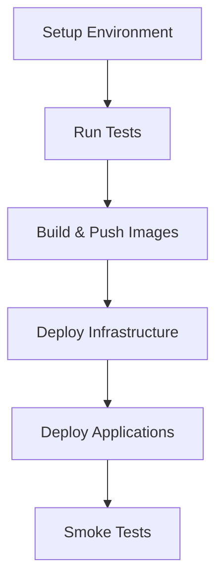

# Agentes de IA para Salud con Integración FHIR y UI de React

Este repositorio contiene una solución integral de agentes de IA para el sector salud que aprovecha los estándares FHIR (Fast Healthcare Interoperability Resources) con una interfaz de usuario moderna basada en React:

1. **Agentes de Salud con CrewAI** - Agentes de IA colaborativos utilizando el framework CrewAI
2. **Agentes de Salud con Autogen** - IA conversacional multiagente utilizando el framework Autogen de Microsoft
3. **UI de Salud con React** - Interfaz web moderna para profesionales de la salud

El sistema implementa agentes médicos especializados de IA que trabajan en conjunto para proporcionar atención integral al paciente, apoyo a la decisión clínica y automatización de flujos de trabajo de salud, manteniendo al mismo tiempo el cumplimiento de HIPAA y la interoperabilidad FHIR.

## 🏥 Resumen de la Arquitectura

### Componentes del Sistema

- **Frontend React**: Interfaz moderna con Material-UI, TypeScript y Redux Toolkit
- **API Gateway**: Servicios backend con FastAPI y monitoreo de estado
- **Capa de Integración de Datos**: API Gateway FHIR con autenticación SMART on FHIR
- **Núcleo de Agentes de IA**: Agentes de salud especializados para diferentes dominios médicos
- **Capa de Orquestación**: Coordinación multiagente y gestión de flujos de trabajo
- **Marco de Seguridad**: Cifrado y controles de acceso cumplidores de HIPAA
- **Monitoreo y Observabilidad**: Registro exhaustivo, métricas y paneles de control

### Especializaciones de los Agentes de Salud

1. **Agente de Médico de Atención Primaria**: Evaluación integral del paciente y coordinación de cuidados
2. **Agente de Cardiólogo**: Evaluación de riesgo cardiovascular y atención cardíaca
3. **Agente de Farmacéutico Clínico**: Seguridad de medicamentos y verificación de interacciones farmacológicas
4. **Agente de Coordinador de Enfermería**: Transiciones de cuidados y educación del paciente
5. **Agente de Medicina de Urgencias**: Triage rápido y evaluación de atención aguda

## 🚀 Inicio Rápido

### Prerrequisitos

- Docker y Docker Compose
- Clave API de OpenAI
- Acceso a un servidor FHIR (servidor de prueba proporcionado por defecto)

### Instalación y Ejecución

1. **Clonar el repositorio**:
   ```bash
   git clone <repository-url>
   cd agentic-healthcare-ai 
   ```

2. **Configurar variables de entorno**:
   ```bash
   cp .env.example .env
   # Editar .env con tus claves API y configuración
   ```

3. **Iniciar el sistema completo**:
   ```bash
   docker-compose up -d
   ```

4. **Acceder a la aplicación**:
   - **UI Principal**: http://localhost:3030
   - **API CrewAI**: http://localhost:8000
   - **API Autogen**: http://localhost:8001
   - **Panel de Grafana**: http://localhost:3000
   - **Registros de Kibana**: http://localhost:5601

### Alternativa: Desarrollo Local

```bash
# Iniciar servidor de desarrollo de la UI
cd ui
npm install
npm start

# Ejecutar servicio CrewAI
cd crewai_fhir_agent
pip install -r requirements.txt
python main.py

# Ejecutar servicio Autogen  
cd autogen_fhir_agent
pip install -r requirements.txt
python main.py
```

## 🌐 Interfaz de Usuario (UI) de React para Salud

### Características

- **Panel de Control**: Vista general del sistema con métricas de rendimiento de agentes y feed de actividad
- **Búsqueda de Pacientes**: Interfaz de selección y búsqueda de pacientes integrada con FHIR
- **Consola de Agentes**: Interfaz principal de interacción con cambio de framework (Autogen/CrewAI)
- **Conversaciones Multiagente**: Interfaz de chat en tiempo real con agentes de IA de salud
- **Tipos de Evaluación**: Flujos de trabajo para evaluación integral, urgencias y revisión de medicamentos
- **Historial de Conversaciones**: Explorar evaluaciones anteriores, ver resúmenes y exportar datos
- **Configuración**: Configuración FHIR, ajustes de agentes y gestión de seguridad

### Stack Tecnológico

- **React 18** con TypeScript para seguridad de tipos
- **Material-UI (MUI) v5** para diseño moderno y accesible
- **Redux Toolkit + RTK Query** para gestión de estado y llamadas a API
- **React Router v6** para navegación
- **Recharts** para análisis y visualización de datos
- **Socket.IO** para funciones en tiempo real

### Arquitectura de la UI

```
src/
├── components/
│   └── Layout/
│       ├── Header.tsx
│       └── Sidebar.tsx
├── pages/
│   ├── Dashboard.tsx
│   ├── PatientSearch.tsx
│   ├── AgentConsole.tsx
│   ├── ConversationHistory.tsx
│   └── Settings.tsx
└── store/
    ├── api/
    │   └── apiSlice.ts
    ├── slices/
    │   ├── agentSlice.ts
    │   ├── conversationSlice.ts
    │   └── patientSlice.ts
    └── store.ts
```

## 🔧 Solución de Salud con CrewAI

### Características

- **Ejecución Secuencial de Tareas**: Los agentes trabajan en secuencias coordinadas
- **Herramientas Especializadas**: Recuperación de datos FHIR, apoyo a la decisión clínica, asistencia diagnóstica
- **Flujos de Trabajo Basados en Tareas**: Enfoque estructurado para evaluaciones clínicas
- **Capacidades de Delegación**: El agente de atención primaria puede delegar a especialistas

### Roles de los Agentes

```python
# Médico de Atención Primaria
- Evaluación integral del paciente
- Coordinación de cuidados
- Identificación de factores de riesgo
- Derivaciones a especialistas

# Cardiólogo  
- Estratificación de riesgo cardiovascular
- Evaluación de condiciones cardíacas
- Recomendaciones de tratamiento

# Farmacéutico Clínico
- Reconciliación de medicamentos
- Detección de interacciones farmacológicas
- Optimización de dosis

# Coordinador de Enfermería
- Gestión de transiciones de cuidados
- Educación del paciente
- Coordinación de seguimiento
```

### Endpoints de la API

- `POST /assessment/comprehensive` - Ejecutar evaluación completa del paciente
- `POST /assessment/emergency` - Evaluación de paciente en urgencias
- `POST /assessment/medication-reconciliation` - Revisión de medicamentos
- `GET /patient/{id}/summary` - Resumen de datos del paciente
- `GET /agents/status` - Estado del sistema de agentes
- `GET /health` - Verificación de estado del servicio

### Ejemplo de Uso

```python
# Evaluación Integral
assessment_request = {
    "patient_id": "patient-123",
    "assessment_type": "comprehensive",
    "urgency": "routine"
}

response = requests.post(
    "http://localhost:8000/assessment/comprehensive",
    json=assessment_request,
    headers={"Authorization": "Bearer your_token"}
)
```

## 🤖 Solución de Salud con Autogen

### Características

- **Conversaciones Multiagente**: Diálogo natural entre agentes especializados
- **Colaboración en Tiempo Real**: Los agentes discuten casos y alcanzan consenso
- **Soporte WebSocket**: Monitoreo en vivo de conversaciones
- **Historial Conversacional**: Trazabilidad completa de las interacciones de los agentes
- **Selección Dinámica de Oradores**: Enrutamiento inteligente basado en el contexto

### Flujo de Conversación

```
Solicitud del Usuario → Evaluación de Atención Primaria → Consulta Especializada → 
Revisión Farmacéutica → Coordinación de Cuidados → Recomendaciones Finales
```

### Endpoints de la API

- `POST /conversation/comprehensive` - Iniciar conversación de evaluación multiagente
- `POST /conversation/emergency` - Consulta multiagente de urgencias  
- `POST /conversation/medication-review` - Conversación centrada en medicamentos
- `WebSocket /ws/conversation/{patient_id}` - Monitoreo en tiempo real de conversaciones
- `GET /conversations/history` - Historial de conversaciones
- `GET /health` - Verificación de estado del servicio

### Ejemplo de Uso

```python
# Iniciar Conversación Integral
conversation_request = {
    "patient_id": "patient-123",
    "conversation_type": "comprehensive",
    "context": {"priority": "high"}
}

response = requests.post(
    "http://localhost:8001/conversation/comprehensive", 
    json=conversation_request,
    headers={"Authorization": "Bearer your_token"}
)
```

## 🐳 Implementación con Docker

### Stack Completo

El sistema incluye una configuración integral de Docker Compose con:

- **healthcare-ui**: Aplicación React con nginx
- **crewai-healthcare-agent**: Servicio CrewAI
- **autogen-healthcare-agent**: Servicio Autogen
- **postgres**: Base de datos para registros de auditoría e historial de conversaciones
- **redis**: Caché y gestión de sesiones
- **nginx-backend**: Balanceador de carga para servicios backend
- **elasticsearch, logstash, kibana**: Stack ELK para registro de eventos
- **prometheus**: Recopilación de métricas
- **grafana**: Visualización de métricas

### Servicios y Puertos

```yaml
services:
  healthcare-ui:        # Puerto 3030 (UI Principal)
  crewai-agent:        # Puerto 8000 (API CrewAI)
  autogen-agent:       # Puerto 8001 (API Autogen)
  nginx-backend:       # Puerto 8080 (Balanceador Backend)
  grafana:            # Puerto 3000 (Monitoreo)
  kibana:             # Puerto 5601 (Registros)
  prometheus:         # Puerto 9090 (Métricas)
```

### Verificaciones de Estado (Health Checks)

Todos los servicios incluyen verificaciones de estado exhaustivas:

```bash
# Verificar todos los servicios
curl http://localhost:3030/health    # Estado UI
curl http://localhost:8000/health    # Estado CrewAI
curl http://localhost:8001/health    # Estado Autogen
```

## 🧪 Pruebas

### Pruebas Automatizadas

```bash
# Ejecutar todas las pruebas
docker-compose -f docker-compose.test.yml up --abort-on-container-exit

# Pruebas UI
cd ui
npm test
npm run test:coverage

# Pruebas Backend
cd crewai_fhir_agent
python -m pytest tests/ -v --cov=.

cd autogen_fhir_agent
python -m pytest tests/ -v --cov=.
```

### Pruebas de Integración

```bash
# Probar integración FHIR
python tests/test_fhir_integration.py

# Probar flujos de trabajo de agentes
python tests/test_agent_workflows.py

# Probar integración de la API de la UI
cd ui
npm run test:integration
```

### Flujos de Trabajo de Pruebas Manuales

1. **Prueba de Navegación UI**:
   - Visitar http://localhost:3030
   - Navegar por todas las páginas
   - Probar la funcionalidad de búsqueda de pacientes
   - Iniciar conversaciones con agentes

2. **Pruebas de Estado de la API**:
   ```bash
   # Probar estado de servicios
   curl -X GET http://localhost:8000/health
   curl -X GET http://localhost:8001/health
   curl -X GET http://localhost:3030/health
   ```

3. **Flujo de Trabajo de extremo a extremo**:
   - Buscar un paciente en la UI
   - Iniciar una evaluación integral
   - Monitorear la conversación en tiempo real con los agentes
   - Revisar resultados y exportar datos

### Pruebas de Carga

```bash
# Instalar dependencias
pip install locust

# Ejecutar pruebas de carga
locust -f tests/load_test.py --host=http://localhost:8000
```

## 🔒 Seguridad y Cumplimiento

### Cumplimiento de HIPAA

- **Cifrado**: Toda la información de salud protegida (PHI) cifrada en tránsito y en reposo
- **Controles de Acceso**: Acceso basado en roles con principios de mínimo necesario
- **Registros de Auditoría**: Registro exhaustivo de todos los accesos a datos
- **Retención de Datos**: Políticas de retención configurables
- **Autenticación**: Autenticación basada en JWT con SMART on FHIR

### Seguridad FHIR

- **SMART on FHIR**: Marco de autorización OAuth 2.0
- **Acceso con Ámbito**: Controles de permisos granulares
- **Gestión de Tokens**: Actualización y validación segura de tokens
- **Cifrado TLS**: Todas las comunicaciones FHIR cifradas

## 📊 Monitoreo y Observabilidad

### Stack de Monitoreo Integrado

- **Prometheus**: Recopilación de métricas y alertas
- **Grafana**: Paneles en tiempo real y visualización
- **Stack ELK**: Registro centralizado y análisis de logs
- **Verificaciones de Estado**: Monitoreo automatizado de salud de servicios

### Métricas Clave

- Tiempos de respuesta de agentes
- Rendimiento de la API FHIR
- Precisión de decisiones clínicas
- Disponibilidad del sistema
- Eventos de seguridad
- Métricas de rendimiento de la UI

### Paneles Personalizados

Acceder a Grafana en http://localhost:3000 con credenciales predeterminadas (admin/admin):

- **Vista General del Sistema**: Salud y rendimiento de servicios
- **Métricas de Salud**: Interacciones de agentes y flujos clínicos
- **Analítica de Usuario**: Patrones de uso y rendimiento de la UI
- **Panel de Seguridad**: Eventos de autenticación y métricas de seguridad

## 🏥 Casos de Uso Clínicos

### 1. Evaluación Integral del Paciente

```
El Agente de Atención Primaria recupera datos del paciente →
El Cardiólogo evalúa el riesgo cardiovascular →
El Farmacéutico revisa los medicamentos →
El Coordinador de Enfermería planifica transiciones de cuidados
```

### 2. Triage en Urgencias

```
El Agente de Urgencias realiza una evaluación rápida →
El Farmacéutico verifica interacciones farmacológicas críticas →
Estratificación de riesgo y planificación de disposición
```

### 3. Reconciliación de Medicamentos

```
El Agente Farmacéutico lidera la revisión de medicamentos →
El Agente de Atención Primaria proporciona contexto clínico →
El Coordinador de Enfermería planifica la implementación
```

### 4. Manejo de Enfermedades Crónicas

```
Agentes específicos de la condición colaboran →
Puntuación de riesgo y análisis de tendencias →
Generación de planes de cuidados personalizados
```

## 🔧 Configuración

### Variables de Entorno

```bash
# Configuración Principal
OPENAI_API_KEY=your_openai_key
FHIR_BASE_URL=https://your-fhir-server.com
FHIR_CLIENT_ID=your_client_id
FHIR_CLIENT_SECRET=your_client_secret

# Seguridad
JWT_SECRET_KEY=your_jwt_secret
DATABASE_PASSWORD=your_db_password
REDIS_PASSWORD=your_redis_password
GRAFANA_PASSWORD=your_grafana_password

# Funcionalidades
ENABLE_CLINICAL_DECISION_SUPPORT=true
ENABLE_DRUG_INTERACTION_CHECKING=true
ENABLE_RISK_SCORING=true

# Configuración UI
REACT_APP_API_BASE_URL=http://localhost:8000
REACT_APP_AUTOGEN_API_URL=http://localhost:8001
REACT_APP_ENABLE_MOCK_DATA=true

# Configuración de Proveedor en la Nube (Opcional)
GCP_PROJECT_ID=your_gcp_project_id
AWS_ACCESS_KEY_ID=your_aws_access_key_id
AZURE_CREDENTIALS=your_azure_credentials
```

### Configuración del Servidor FHIR

El sistema es compatible con cualquier servidor FHIR R4. Para pruebas, utiliza el servidor público HAPI FHIR.

```python
fhir_config = FHIRConfig(
    base_url="https://hapi.fhir.org/baseR4/",
    client_id="healthcare_ai_agent",
    scopes=["patient/*.read", "user/*.read"]
)
```

## 📈 Rendimiento

### Benchmarks

- **Solución CrewAI**: 
  - Evaluación integral: 45-60 segundos
  - Evaluación de urgencias: 15-25 segundos
  - Reconciliación de medicamentos: 20-30 segundos

- **Solución Autogen**:
  - Conversación multiagente: 60-90 segundos
  - Consulta de urgencias: 20-35 segundos
  - Colaboración en tiempo real: 5-10 segundos por turno

- **Rendimiento de la UI**:
  - Carga inicial: < 3 segundos
  - Navegación entre páginas: < 500ms
  - Manejo de respuestas API: < 1 segundo

### Consejos de Optimización

1. **Caché**: Habilitar caché de Redis para datos FHIR
2. **Procesamiento Paralelo**: Usar async/await para operaciones concurrentes
3. **Selección de Modelos**: Elegir modelos LLM apropiados para cada agente
4. **Límites de Recursos**: Configurar límites adecuados de memoria y CPU
5. **Optimización de UI**: División de código (code splitting) y carga diferida (lazy loading)

## 🚀 Implementación / Despliegue

### Entorno de Desarrollo

```bash
# Iniciar stack de desarrollo
docker-compose up -d

# Desarrollo con recarga automática
cd ui && npm start  # UI en puerto 3000
python crewai_fhir_agent/main.py  # CrewAI en puerto 8000
python autogen_fhir_agent/main.py  # Autogen en puerto 8001
```

### Despliegue en Producción

1. **Configuración de Infraestructura**:
   ```bash
   # Desplegar con Docker Compose de producción
   docker-compose -f docker-compose.prod.yml up -d
   ```

2. **Despliegue en Kubernetes**:
   ```bash
   kubectl apply -f k8s/
   ```

3. **Configuración de Entorno**:
   - Configurar certificados SSL adecuados
   - Configurar conexiones a la base de datos
   - Establecer monitoreo y alertas
   - Habilitar registro de auditoría

### Consideraciones de Escalabilidad

- **Escalado Horizontal**: Múltiples instancias de servicios de agentes
- **Optimización de Base de Datos**: Pool de conexiones e indexación
- **Estrategia de Caché**: Clúster de Redis para gestión de sesiones
- **Balanceo de Carga**: NGINX con verificaciones de estado
- **CDN**: Distribución de activos estáticos para la UI

## 🤝 Cómo Contribuir

1. Hacer fork del repositorio
2. Crear una rama para la funcionalidad
3. Implementar cambios con pruebas
4. Garantizar cumplimiento de HIPAA
5. Enviar pull request

### Pautas de Desarrollo

- Seguir regulaciones de privacidad de datos de salud
- Implementar manejo exhaustivo de errores
- Añadir registros para trazabilidad de auditoría
- Escribir pruebas para flujos de trabajo clínicos
- Documentar cambios en la API
- Los componentes de la UI deben ser accesibles (WCAG 2.1)

### Estándares de Calidad de Código

```bash
# Calidad de código Python
black .
flake8 .
mypy .

# Calidad de código TypeScript/React
cd ui
npm run lint
npm run type-check
npm run test
```

## 📚 Recursos Adicionales

### Estándares de Salud

- [Especificación FHIR R4](https://hl7.org/fhir/R4/)
- [SMART on FHIR](https://docs.smarthealthit.org/)
- [Medidas de Seguridad Técnicas de HIPAA](https://www.hhs.gov/hipaa/for-professionals/index.html)

### Frameworks de IA

- [Documentación de CrewAI](https://docs.crewai.com/)
- [Microsoft Autogen](https://microsoft.github.io/autogen/)
- [Referencia de la API de OpenAI](https://platform.openai.com/docs/api-reference)

### Tecnologías Frontend

- [Documentación de React](https://react.dev/)
- [Material-UI](https://mui.com/)
- [Redux Toolkit](https://redux-toolkit.js.org/)
- [TypeScript](https://www.typescriptlang.org/)

### Apoyo a la Decisión Clínica

- [Guías Clínicas](https://www.ahrq.gov/gam/index.html)
- [Bases de Datos de Interacciones Farmacológicas](https://www.drugs.com/drug_interactions.html)
- Herramientas de Evaluación de Riesgos

## 📄 Licencia

Este proyecto está licenciado bajo la Licencia MIT - consulte el archivo [LICENSE](LICENSE) para obtener más detalles.

## ⚠️ Aviso Legal Importante

Este software está destinado a fines educativos y de investigación. No debe usarse como sustituto del consejo médico profesional, diagnóstico o tratamiento. Consulte siempre con profesionales de la salud cualificados para tomar decisiones médicas.

## 🆘 Soporte

Para soporte y preguntas:
- Crear un issue en el repositorio de GitHub
- Consultar la documentación y preguntas frecuentes
- Contactar al equipo de desarrollo

---

**Construido con ❤️ para la innovación en salud, manteniendo los más altos estándares de privacidad y seguridad del paciente.** 



## 📂 Estructura del Proyecto

- **`agent_backend/`**: Un backend simple en Python para tareas relacionadas con agentes.
- **`autogen_fhir_agent/`**: La implementación del agente de salud basado en Microsoft Autogen.
- **`crewai_fhir_agent/`**: La implementación del agente de salud basado en CrewAI.
- **`docker/`**: Contiene archivos Docker Compose para orquestar los diferentes servicios.
- **`docs/`**: Documentación del proyecto, incluidas guías de implementación y hojas de trucos.
- **`fhir_mcp_server/`**: Un servidor de Protocolo de Contexto de Modelo (MCP) para interactuar con un servidor FHIR.
- **`fhir_proxy/`**: Un servicio proxy ligero para comunicarse con el servidor FHIR.
- **`kubernetes/`**: Manifiestos y scripts de Kubernetes para desplegar la aplicación en un clúster de Kubernetes.
- **`shared/`**: Módulos y utilidades de Python compartidos utilizados por los diferentes backends de agentes.
- **`ui/`**: La aplicación frontend basada en React para interactuar con los agentes de salud.

### Endpoints de la API

- `POST /assessment/comprehensive` - Ejecutar evaluación completa del paciente
- `POST /assessment/emergency` - Evaluación de paciente en urgencias
- `POST /assessment/medication-reconciliation` - Revisión de medicamentos
- `GET /patient/{id}/summary` - Resumen de datos del paciente
- `GET /agents/status` - Estado del sistema de agentes
- `GET /health` - Verificación de estado del servicio

- `POST /conversation/comprehensive` - Iniciar conversación de evaluación multiagente
- `POST /conversation/emergency` - Consulta multiagente de urgencias  
- `POST /conversation/medication-review` - Conversación centrada en medicamentos
- `WebSocket /ws/conversation/{patient_id}` - Monitoreo en tiempo real de conversaciones
- `GET /conversations/history` - Historial de conversaciones
- `GET /health` - Verificación de estado del servicio
