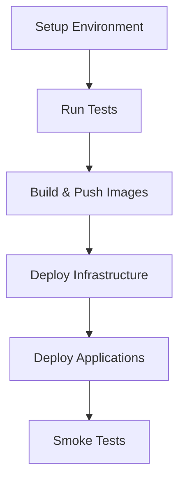

# Healthcare AI Agents with FHIR Integration & React UI

This repository contains a comprehensive AI agent solution for healthcare that leverages FHIR (Fast Healthcare Interoperability Resources) standards with a modern React-based user interface:

1. **CrewAI Healthcare Agents** - Collaborative AI agents using the CrewAI framework
2. **Autogen Healthcare Agents** - Multi-agent conversational AI using Microsoft's Autogen framework
3. **React Healthcare UI** - Modern web interface for healthcare professionals

The system implements specialized medical AI agents that work together to provide comprehensive patient care, clinical decision support, and healthcare workflow automation while maintaining HIPAA compliance and FHIR interoperability.

## 🏥 Architecture Overview

### System Components

- **React Frontend**: Modern UI with Material-UI, TypeScript, and Redux Toolkit
- **API Gateway**: FastAPI backend services with health monitoring
- **Data Integration Layer**: FHIR API Gateway with SMART on FHIR authentication
- **AI Agent Core**: Specialized healthcare agents for different medical domains
- **Orchestration Layer**: Multi-agent coordination and workflow management
- **Security Framework**: HIPAA-compliant encryption and access controls
- **Monitoring & Observability**: Comprehensive logging, metrics, and dashboards

### Healthcare Agent Specializations

1. **Primary Care Physician Agent**: Comprehensive patient assessment and care coordination
2. **Cardiologist Agent**: Cardiovascular risk assessment and cardiac care
3. **Clinical Pharmacist Agent**: Medication safety and drug interaction checking
4. **Nurse Care Coordinator Agent**: Care transitions and patient education
5. **Emergency Medicine Agent**: Rapid triage and acute care assessment

## 🚀 Quick Start

### Prerequisites

- Docker and Docker Compose
- OpenAI API key
- Access to a FHIR server (test server provided by default)

### Installation & Running

1. **Clone the repository**:
   ```bash
   git clone <repository-url>
   cd agentic-healthcare-ai 
   ```

2. **Set up environment variables**:
   ```bash
   cp .env.example .env
   # Edit .env with your API keys and configuration
   ```

3. **Start the complete system**:
   ```bash
   docker-compose up -d
   ```

4. **Access the application**:
   - **Main UI**: http://localhost:3030
   - **CrewAI API**: http://localhost:8000
   - **Autogen API**: http://localhost:8001
   - **Grafana Dashboard**: http://localhost:3000
   - **Kibana Logs**: http://localhost:5601

### Alternative: Local Development

```bash
# Start UI development server
cd ui
npm install
npm start

# Run CrewAI service
cd crewai_fhir_agent
pip install -r requirements.txt
python main.py

# Run Autogen service  
cd autogen_fhir_agent
pip install -r requirements.txt
python main.py
```

## 🌐 React Healthcare UI

### Features

- **Dashboard**: System overview with agent performance metrics and activity feed
- **Patient Search**: FHIR-integrated patient search and selection interface
- **Agent Console**: Main interaction interface with framework switching (Autogen/CrewAI)
- **Multi-Agent Conversations**: Real-time chat interface with AI healthcare agents
- **Assessment Types**: Comprehensive, emergency, and medication review workflows
- **Conversation History**: Browse past assessments, view summaries, and export data
- **Settings**: FHIR configuration, agent settings, and security management

### Technology Stack

- **React 18** with TypeScript for type safety
- **Material-UI (MUI) v5** for modern, accessible design
- **Redux Toolkit + RTK Query** for state management and API calls
- **React Router v6** for navigation
- **Recharts** for analytics and data visualization
- **Socket.IO** for real-time features

### UI Architecture

```
src/
├── components/
│   └── Layout/
│       ├── Header.tsx
│       └── Sidebar.tsx
├── pages/
│   ├── Dashboard.tsx
│   ├── PatientSearch.tsx
│   ├── AgentConsole.tsx
│   ├── ConversationHistory.tsx
│   └── Settings.tsx
└── store/
    ├── api/
    │   └── apiSlice.ts
    ├── slices/
    │   ├── agentSlice.ts
    │   ├── conversationSlice.ts
    │   └── patientSlice.ts
    └── store.ts
```

## 🔧 CrewAI Healthcare Solution

### Features

- **Sequential Task Execution**: Agents work in coordinated sequences
- **Specialized Tools**: FHIR data retrieval, clinical decision support, diagnostic assistance
- **Task-Based Workflows**: Structured approach to clinical assessments
- **Delegation Capabilities**: Primary care agent can delegate to specialists

### Agent Roles

```python
# Primary Care Physician
- Comprehensive patient assessment
- Care coordination
- Risk factor identification
- Specialist referrals

# Cardiologist  
- Cardiovascular risk stratification
- Cardiac condition evaluation
- Treatment recommendations

# Clinical Pharmacist
- Medication reconciliation
- Drug interaction screening
- Dosing optimization

# Nurse Care Coordinator
- Care transition management
- Patient education
- Follow-up coordination
```

### API Endpoints

- `POST /assessment/comprehensive` - Run full patient assessment
- `POST /assessment/emergency` - Emergency patient evaluation
- `POST /assessment/medication-reconciliation` - Medication review
- `GET /patient/{id}/summary` - Patient data summary
- `GET /agents/status` - Agent system status
- `GET /health` - Service health check

### Example Usage

```python
# Comprehensive Assessment
assessment_request = {
    "patient_id": "patient-123",
    "assessment_type": "comprehensive",
    "urgency": "routine"
}

response = requests.post(
    "http://localhost:8000/assessment/comprehensive",
    json=assessment_request,
    headers={"Authorization": "Bearer your_token"}
)
```

## 🤖 Autogen Healthcare Solution

### Features

- **Multi-Agent Conversations**: Natural dialogue between specialized agents
- **Real-Time Collaboration**: Agents discuss cases and build consensus
- **WebSocket Support**: Live conversation monitoring
- **Conversational History**: Complete audit trail of agent interactions
- **Dynamic Speaker Selection**: Intelligent routing based on context

### Conversation Flow

```
User Request → Primary Care Assessment → Specialist Consultation → 
Pharmacist Review → Care Coordination → Final Recommendations
```

### API Endpoints

- `POST /conversation/comprehensive` - Start multi-agent assessment conversation
- `POST /conversation/emergency` - Emergency multi-agent consultation  
- `POST /conversation/medication-review` - Medication-focused conversation
- `WebSocket /ws/conversation/{patient_id}` - Real-time conversation monitoring
- `GET /conversations/history` - Conversation history
- `GET /health` - Service health check

### Example Usage

```python
# Start Comprehensive Conversation
conversation_request = {
    "patient_id": "patient-123",
    "conversation_type": "comprehensive",
    "context": {"priority": "high"}
}

response = requests.post(
    "http://localhost:8001/conversation/comprehensive", 
    json=conversation_request,
    headers={"Authorization": "Bearer your_token"}
)
```

## 🐳 Docker Deployment

### Complete Stack

The system includes a comprehensive Docker Compose setup with:

- **healthcare-ui**: React application with nginx
- **crewai-healthcare-agent**: CrewAI service
- **autogen-healthcare-agent**: Autogen service
- **postgres**: Database for audit logs and conversation history
- **redis**: Caching and session management
- **nginx-backend**: Load balancer for backend services
- **elasticsearch, logstash, kibana**: ELK stack for logging
- **prometheus**: Metrics collection
- **grafana**: Metrics visualization

### Services and Ports

```yaml
services:
  healthcare-ui:        # Port 3030 (Main UI)
  crewai-agent:        # Port 8000 (CrewAI API)
  autogen-agent:       # Port 8001 (Autogen API)
  nginx-backend:       # Port 8080 (Backend LB)
  grafana:            # Port 3000 (Monitoring)
  kibana:             # Port 5601 (Logs)
  prometheus:         # Port 9090 (Metrics)
```

### Health Checks

All services include comprehensive health checks:

```bash
# Check all services
curl http://localhost:3030/health    # UI Health
curl http://localhost:8000/health    # CrewAI Health
curl http://localhost:8001/health    # Autogen Health
```

## 🧪 Testing

### Automated Testing

```bash
# Run all tests
docker-compose -f docker-compose.test.yml up --abort-on-container-exit

# UI Tests
cd ui
npm test
npm run test:coverage

# Backend Tests
cd crewai_fhir_agent
python -m pytest tests/ -v --cov=.

cd autogen_fhir_agent
python -m pytest tests/ -v --cov=.
```

### Integration Tests

```bash
# Test FHIR integration
python tests/test_fhir_integration.py

# Test agent workflows
python tests/test_agent_workflows.py

# Test UI API integration
cd ui
npm run test:integration
```

### Manual Testing Workflows

1. **UI Navigation Test**:
   - Visit http://localhost:3030
   - Navigate through all pages
   - Test patient search functionality
   - Initiate agent conversations

2. **API Health Tests**:
   ```bash
   # Test service health
   curl -X GET http://localhost:8000/health
   curl -X GET http://localhost:8001/health
   curl -X GET http://localhost:3030/health
   ```

3. **End-to-End Workflow**:
   - Search for a patient in the UI
   - Start a comprehensive assessment
   - Monitor real-time agent conversation
   - Review results and export data

### Load Testing

```bash
# Install dependencies
pip install locust

# Run load tests
locust -f tests/load_test.py --host=http://localhost:8000
```

## 🔒 Security & Compliance

### HIPAA Compliance

- **Encryption**: All PHI encrypted in transit and at rest
- **Access Controls**: Role-based access with minimum necessary principles
- **Audit Trails**: Comprehensive logging of all data access
- **Data Retention**: Configurable retention policies
- **Authentication**: JWT-based authentication with SMART on FHIR

### FHIR Security

- **SMART on FHIR**: OAuth 2.0 authorization framework
- **Scoped Access**: Granular permission controls
- **Token Management**: Secure token refresh and validation
- **TLS Encryption**: All FHIR communications encrypted

## 📊 Monitoring & Observability

### Integrated Monitoring Stack

- **Prometheus**: Metrics collection and alerting
- **Grafana**: Real-time dashboards and visualization
- **ELK Stack**: Centralized logging and log analysis
- **Health Checks**: Automated service health monitoring

### Key Metrics

- Agent response times
- FHIR API performance
- Clinical decision accuracy
- System availability
- Security events
- UI performance metrics

### Custom Dashboards

Access Grafana at http://localhost:3000 with default credentials (admin/admin):

- **System Overview**: Service health and performance
- **Healthcare Metrics**: Agent interactions and clinical workflows
- **User Analytics**: UI usage patterns and performance
- **Security Dashboard**: Authentication events and security metrics

## 🏥 Clinical Use Cases

### 1. Comprehensive Patient Assessment

```
Primary Care Agent retrieves patient data →
Cardiologist evaluates CV risk →
Pharmacist reviews medications →
Nurse Coordinator plans care transitions
```

### 2. Emergency Department Triage

```
Emergency Agent performs rapid assessment →
Pharmacist checks critical drug interactions →
Risk stratification and disposition planning
```

### 3. Medication Reconciliation

```
Pharmacist Agent leads medication review →
Primary Care Agent provides clinical context →
Nurse Coordinator plans implementation
```

### 4. Chronic Disease Management

```
Condition-specific agents collaborate →
Risk scoring and trend analysis →
Personalized care plan generation
```

## 🔧 Configuration

### Environment Variables

```bash
# Core Configuration
OPENAI_API_KEY=your_openai_key
FHIR_BASE_URL=https://your-fhir-server.com
FHIR_CLIENT_ID=your_client_id
FHIR_CLIENT_SECRET=your_client_secret

# Security
JWT_SECRET_KEY=your_jwt_secret
DATABASE_PASSWORD=your_db_password
REDIS_PASSWORD=your_redis_password
GRAFANA_PASSWORD=your_grafana_password

# Features
ENABLE_CLINICAL_DECISION_SUPPORT=true
ENABLE_DRUG_INTERACTION_CHECKING=true
ENABLE_RISK_SCORING=true

# UI Configuration
REACT_APP_API_BASE_URL=http://localhost:8000
REACT_APP_AUTOGEN_API_URL=http://localhost:8001
REACT_APP_ENABLE_MOCK_DATA=true

# Cloud Provider Configuration (Optional)
GCP_PROJECT_ID=your_gcp_project_id
AWS_ACCESS_KEY_ID=your_aws_access_key_id
AZURE_CREDENTIALS=your_azure_credentials
```

### FHIR Server Setup

The system supports any FHIR R4 compliant server. For testing, it uses the public HAPI FHIR server.

```python
fhir_config = FHIRConfig(
    base_url="https://hapi.fhir.org/baseR4/",
    client_id="healthcare_ai_agent",
    scopes=["patient/*.read", "user/*.read"]
)
```

## 📈 Performance

### Benchmarks

- **CrewAI Solution**: 
  - Comprehensive assessment: 45-60 seconds
  - Emergency assessment: 15-25 seconds
  - Medication reconciliation: 20-30 seconds

- **Autogen Solution**:
  - Multi-agent conversation: 60-90 seconds
  - Emergency consultation: 20-35 seconds
  - Real-time collaboration: 5-10 seconds per turn

- **UI Performance**:
  - Initial load: < 3 seconds
  - Page navigation: < 500ms
  - API response handling: < 1 second

### Optimization Tips

1. **Caching**: Enable Redis caching for FHIR data
2. **Parallel Processing**: Use async/await for concurrent operations
3. **Model Selection**: Choose appropriate LLM models for each agent
4. **Resource Limits**: Configure appropriate memory and CPU limits
5. **UI Optimization**: Code splitting and lazy loading

## 🚀 Deployment

### Development Environment

```bash
# Start development stack
docker-compose up -d

# Development with hot reload
cd ui && npm start  # UI on port 3000
python crewai_fhir_agent/main.py  # CrewAI on port 8000
python autogen_fhir_agent/main.py  # Autogen on port 8001
```

### Production Deployment

1. **Infrastructure Setup**:
   ```bash
   # Deploy with production Docker Compose
   docker-compose -f docker-compose.prod.yml up -d
   ```

2. **Kubernetes Deployment**:
   ```bash
   kubectl apply -f k8s/
   ```

3. **Environment Configuration**:
   - Set up proper SSL certificates
   - Configure database connections
   - Set up monitoring and alerting
   - Enable audit logging

### Scaling Considerations

- **Horizontal Scaling**: Multiple agent service instances
- **Database Optimization**: Connection pooling and indexing
- **Caching Strategy**: Redis cluster for session management
- **Load Balancing**: NGINX with health checks
- **CDN**: Static asset distribution for UI

## 🤝 Contributing

1. Fork the repository
2. Create a feature branch
3. Implement changes with tests
4. Ensure HIPAA compliance
5. Submit pull request

### Development Guidelines

- Follow healthcare data privacy regulations
- Implement comprehensive error handling
- Add logging for audit trails
- Write tests for clinical workflows
- Document API changes
- UI components must be accessible (WCAG 2.1)

### Code Quality Standards

```bash
# Python code quality
black .
flake8 .
mypy .

# TypeScript/React code quality
cd ui
npm run lint
npm run type-check
npm run test
```

## 📚 Additional Resources

### Healthcare Standards

- [FHIR R4 Specification](https://hl7.org/fhir/R4/)
- [SMART on FHIR](https://docs.smarthealthit.org/)
- [HIPAA Technical Safeguards](https://www.hhs.gov/hipaa/for-professionals/index.html)

### AI Frameworks

- [CrewAI Documentation](https://docs.crewai.com/)
- [Microsoft Autogen](https://microsoft.github.io/autogen/)
- [OpenAI API Reference](https://platform.openai.com/docs/api-reference)

### Frontend Technologies

- [React Documentation](https://react.dev/)
- [Material-UI](https://mui.com/)
- [Redux Toolkit](https://redux-toolkit.js.org/)
- [TypeScript](https://www.typescriptlang.org/)

### Clinical Decision Support

- [Clinical Guidelines](https://www.ahrq.gov/gam/index.html)
- [Drug Interaction Databases](https://www.drugs.com/drug_interactions.html)
- Risk Assessment Tools

## 📄 License

This project is licensed under the MIT License - see the [LICENSE](LICENSE) file for details.

## ⚠️ Important Disclaimer

This software is intended for educational and research purposes. It should not be used as a substitute for professional medical advice, diagnosis, or treatment. Always consult with qualified healthcare professionals for medical decisions.

## 🆘 Support

For support and questions:
- Create an issue in the GitHub repository
- Check the documentation and FAQ
- Contact the development team

---

**Built with ❤️ for healthcare innovation while maintaining the highest standards of patient privacy and safety.** 



## 📂 Project Structure

- **`agent_backend/`**: A simple Python backend for agent-related tasks.
- **`autogen_fhir_agent/`**: The Microsoft Autogen-based healthcare agent implementation.
- **`crewai_fhir_agent/`**: The CrewAI-based healthcare agent implementation.
- **`docker/`**: Contains Docker Compose files for orchestrating the different services.
- **`docs/`**: Project documentation, including deployment guides and cheat sheets.
- **`fhir_mcp_server/`**: A Model Context Protocol (MCP) server for interacting with a FHIR server.
- **`fhir_proxy/`**: A lightweight proxy service to communicate with the FHIR server.
- **`kubernetes/`**: Kubernetes manifests and scripts for deploying the application to a Kubernetes cluster.
- **`shared/`**: Shared Python modules and utilities used by the different agent backends.
- **`ui/`**: The React-based frontend application for interacting with the healthcare agents.

### API Endpoints

- `POST /assessment/comprehensive` - Run full patient assessment
- `POST /assessment/emergency` - Emergency patient evaluation
- `POST /assessment/medication-reconciliation` - Medication review
- `GET /patient/{id}/summary` - Patient data summary
- `GET /agents/status` - Agent system status
- `GET /health` - Service health check

- `POST /conversation/comprehensive` - Start multi-agent assessment conversation
- `POST /conversation/emergency` - Emergency multi-agent consultation  
- `POST /conversation/medication-review` - Medication-focused conversation
- `WebSocket /ws/conversation/{patient_id}` - Real-time conversation monitoring
- `GET /conversations/history` - Conversation history
- `GET /health` - Service health check
