# Healthcare AI Deployment Standardization

## 🎯 Overview

This document outlines the standardization efforts to ensure consistency between Kubernetes and Docker Compose deployments of the Healthcare AI Agent system.

## 📊 Architecture Overview

```mermaid
graph TB
    subgraph "Standardized Deployment Architecture"
        K8S[Kubernetes Deployment]
        DC[Docker Compose]
        
        K8S --> K8Services[Services]
        DC --> DCServices[Services]
        
        K8Services --> K8Agent["✅ Agent Backend: Port 8002<br/>Image: healthcare-ai/agent-backend:latest"]
        K8Services --> K8CrewAI["✅ CrewAI: Port 8000<br/>Image: healthcare-ai/crewai-healthcare-agent:latest"]
        K8Services --> K8AutoGen["✅ AutoGen: Port 8001<br/>Image: healthcare-ai/autogen-healthcare-agent:latest"]
        K8Services --> K8FHIR["✅ FHIR Proxy: Port 8003<br/>Image: healthcare-ai/fhir-proxy:latest"]
        K8Services --> K8MCP["✅ FHIR MCP: Port 8004<br/>Image: healthcare-ai/fhir-mcp-server:latest"]
        
        DCServices --> DCAgent["✅ Agent Backend: Port 8002<br/>Image: healthcare-ai/agent-backend:latest"]
        DCServices --> DCCrewAI["✅ CrewAI: Port 8000<br/>Image: healthcare-ai/crewai-healthcare-agent:latest"]
        DCServices --> DCAutoGen["✅ AutoGen: Port 8001<br/>Image: healthcare-ai/autogen-healthcare-agent:latest"]
        DCServices --> DCFHIR["✅ FHIR Proxy: Port 8003<br/>Image: healthcare-ai/fhir-proxy:latest"]
        DCServices --> DCMCP["✅ FHIR MCP: Port 8004<br/>Image: healthcare-ai/fhir-mcp-server:latest"]
    end
    
    subgraph "Consistent Configuration"
        CF1["✅ Same Dockerfiles"]
        CF2["✅ Same Port Mappings"]
        CF3["✅ Same Image Names"]
        CF4["✅ Same Health Checks"]
        CF5["✅ Same Environment Variables"]
    end
```



## 📋 Standardization Changes Made

### ✅ 1. Port Standardization

| Service | Port | Internal Port | Health Check |
|---------|------|---------------|--------------|
| **Agent Backend** | 8002 | 8002 | `/api/health` |
| **CrewAI Agent** | 8000 | 8000 | `/health` |
| **AutoGen Agent** | 8001 | 8001 | `/health` |
| **FHIR Proxy** | 8003 | 8003 | `/health` |
| **FHIR MCP Server** | 8004 | 8004 | `/health` |
| **Healthcare UI** | 3030 | 80 | `/` |
| **PostgreSQL** | 5432 | 5432 | `pg_isready` |
| **Redis** | 6379 | 6379 | `redis-cli ping` |

### ✅ 2. Image Naming Convention

**Standardized Format:** `healthcare-ai/{service-name}:latest`

| Service | Standardized Image Name |
|---------|------------------------|
| Agent Backend | `healthcare-ai/agent-backend:latest` |
| CrewAI Agent | `healthcare-ai/crewai-healthcare-agent:latest` |
| AutoGen Agent | `healthcare-ai/autogen-healthcare-agent:latest` |
| FHIR Proxy | `healthcare-ai/fhir-proxy:latest` |
| FHIR MCP Server | `healthcare-ai/fhir-mcp-server:latest` |
| Healthcare UI | `healthcare-ai/healthcare-ui:latest` |

### ✅ 3. Dockerfile Consistency

All services now use consistent Dockerfile patterns:
- **Base Image:** `python:3.11-slim` for Python services
- **Working Directory:** `/app`
- **Health Checks:** Implemented for all services
- **Security:** Non-root users where applicable
- **Caching:** Optimized layer caching with requirements first

### ✅ 4. Environment Variables

Standardized environment variable naming and usage across both deployments:

```yaml
# Common Environment Variables
- OPENAI_API_KEY=${OPENAI_API_KEY}
- FHIR_SERVER_URL=${FHIR_SERVER_URL}
- DATABASE_URL=${DATABASE_URL}
- REDIS_URL=${REDIS_URL}
- ENVIRONMENT=${ENVIRONMENT}
```

### ✅ 5. Health Check Endpoints

| Service | Endpoint | Expected Response |
|---------|----------|-------------------|
| Agent Backend | `GET /api/health` | `{"status": "healthy", ...}` |
| CrewAI/AutoGen | `GET /health` | HTTP 200 |
| FHIR Proxy | `GET /health` | HTTP 200 |
| FHIR MCP | `GET /health` | HTTP 200 |

## 🔧 Fixed Issues

### ❌ Before Standardization

1. **Port Conflicts:**
   - Agent backend: Docker used `8000:8002` but app expected port 8000
   - Inconsistent internal/external port mapping

2. **Image Naming:**
   - K8S: `healthcare-ai/service:latest`
   - Docker: `service:latest`

3. **Missing Services:**
   - Agent backend missing from main Docker Compose
   - FHIR MCP server not in original K8S

4. **Health Checks:**
   - Inconsistent health check paths
   - Some services missing health checks

### ✅ After Standardization

1. **Consistent Ports:**
   - All services use consistent port mapping
   - Health checks on correct ports
   - No port conflicts between deployments

2. **Unified Image Names:**
   - Both deployments use `healthcare-ai/` prefix
   - Consistent image tags and naming

3. **Complete Service Coverage:**
   - All services available in both deployments
   - Feature parity between K8S and Docker

4. **Robust Health Monitoring:**
   - All services have proper health checks
   - Consistent health check endpoints

## 🚀 Deployment Commands

### Docker Compose

```bash
# Full stack deployment
cd docker
docker-compose up --build -d

# Agents only (lightweight)
docker-compose -f docker-compose.agents.yml up --build -d

# Check status
docker-compose ps

# View logs
docker-compose logs -f agent-backend
```

### Kubernetes

```bash
# Deploy to cluster
cd kubernetes
kubectl apply -f manifests/

# Check status
kubectl get pods -n healthcare-ai

# View logs
kubectl logs -f deployment/agent-backend -n healthcare-ai
```

## 🔍 Verification

### Port Accessibility Test

```bash
# Agent Backend
curl http://localhost:8002/api/health

# CrewAI Agent  
curl http://localhost:8000/health

# AutoGen Agent
curl http://localhost:8001/health

# FHIR Proxy
curl http://localhost:8003/health

# FHIR MCP Server
curl http://localhost:8004/health
```

### Service Discovery Test

```bash
# Docker Compose
docker-compose ps

# Kubernetes
kubectl get services -n healthcare-ai
```

## 📊 Resource Requirements

### Minimum Requirements
- **Memory:** 8GB RAM
- **CPU:** 4 cores
- **Storage:** 10GB free space

### Recommended Requirements
- **Memory:** 16GB RAM
- **CPU:** 8 cores  
- **Storage:** 20GB free space

## 🛠️ Troubleshooting

### Common Issues

1. **Port Already in Use:**
   ```bash
   # Check what's using the port
   netstat -ano | findstr :8000
   
   # Kill the process if needed
   taskkill /PID <pid> /F
   ```

2. **Image Build Failures:**
   ```bash
   # Clean Docker cache
   docker system prune -f
   
   # Rebuild without cache
   docker-compose build --no-cache
   ```

3. **Health Check Failures:**
   ```bash
   # Check service logs
   docker logs <container-name>
   
   # Test health endpoint manually
   docker exec <container> curl localhost:8002/api/health
   ```

## 📈 Benefits of Standardization

1. **Consistency:** Both deployments behave identically
2. **Maintainability:** Easier to manage and update
3. **Debugging:** Consistent troubleshooting across environments
4. **Scalability:** Uniform scaling patterns
5. **Documentation:** Single source of truth for configuration

## 🔄 Migration Guide

### From Old to New Configuration

1. **Stop existing services:**
   ```bash
   docker-compose down
   kubectl delete namespace healthcare-ai
   ```

2. **Pull latest changes:**
   ```bash
   git pull origin main
   ```

3. **Deploy with new configuration:**
   ```bash
   # Docker
   docker-compose up --build -d
   
   # Kubernetes  
   kubectl apply -f kubernetes/manifests/
   ```

## 📝 Maintenance

### Regular Updates

1. **Update base images:** Monthly security updates
2. **Health check monitoring:** Ensure all endpoints respond
3. **Resource monitoring:** Check CPU/memory usage
4. **Log rotation:** Manage log file sizes

### Backup Strategy

1. **Database:** Regular PostgreSQL backups
2. **Configuration:** Version control all configs
3. **Persistent volumes:** Backup strategy for data

---

**Last Updated:** December 26, 2024  
**Version:** 1.0  
**Author:** Healthcare AI Team